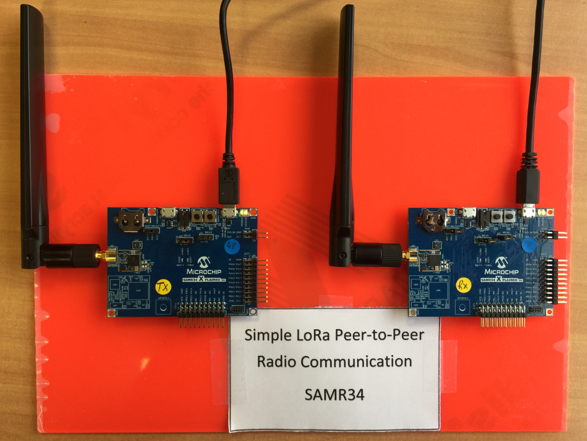
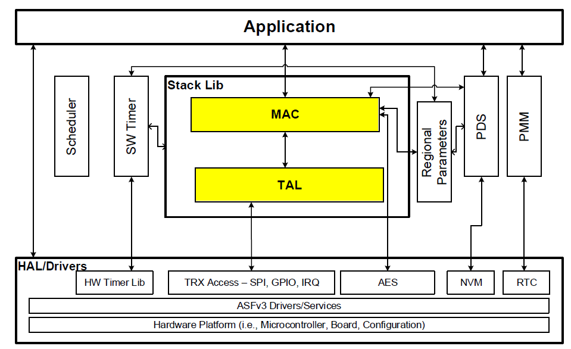
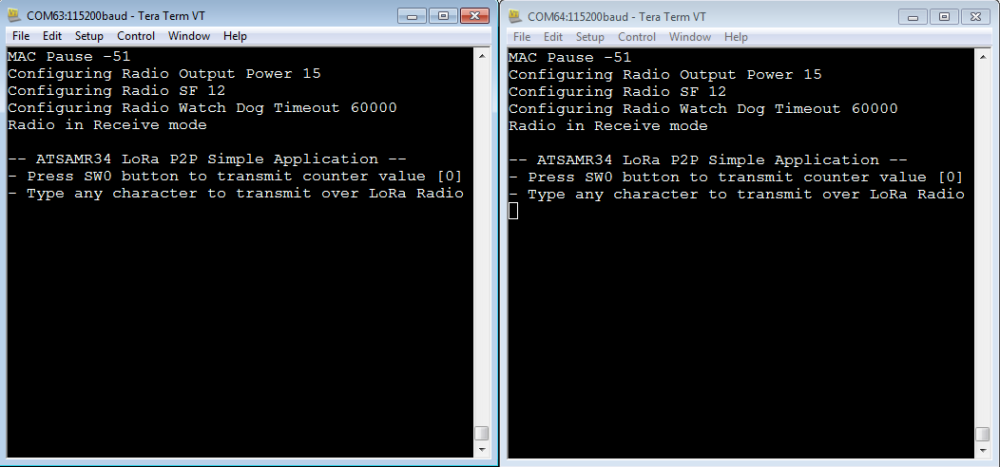

# ATSAMR34_LORA_P2P_SIMPLE_APP
> Adding Simple LoRa Peer-to-Peer Connectivity to the ATSAMR34 Xplained-Pro Kit

This simple example demonstrates how to establish a peer-to-peer communication between 2x ATSAMR34 Xplained Pro boards using LoRa modulation.

For more information on Microchip ATSAMR34 LoRa SiP devices, visit Microchip webpage: </br>
https://www.microchip.com/design-centers/wireless-connectivity/low-power-wide-area-networks/lora-technology/sam-r34-r35



## Get a Microchip ATSAMR34 Xplained Pro evaluation kit

The ATSAMR34 Xplained Pro evaluation kit is a hardware platform used to evaluate the ATSAMR34 Low Power LoRa® Sub-GHz SiP. It is supported by Atmel Studio 7.0 IDE and a collection of sample codes are available from Advanced Software Framework (ASFv3) since the 3.44.0 release.
The Xplained Pro MCU series evaluation kit includes an on-board Embedded Debugger (EDBG), and no external tools are necessary to program or debug the ATSAMR34.
The kit offers a set of features that enable the user to get started with the ATSAMR34 Low Power LoRa® Sub-GHz SiP peripherals right away, and to understand how to integrate the device in your own design.
The ATSAMR34 Xplained Pro kit contains the following items:
- One ATSAMR34 Xplained Pro </br>
- One external antenna </br>


## Software

- Download and install Atmel Studio 7.0 IDE. </br>
https://www.microchip.com/mplab/avr-support/atmel-studio-7

- Open Atmel Studio 7.0 IDE. </br>
- Then, you need Advanced Software Framework (ASFv3) v3.44.0 release or upper release. </br>
Install ASFv3 as an extension to Atmel Studio from the menu: Tools -> Extensions and Updates …
- Once the installation is complete, you must restart Atmel Studio. </br>
- Download and install a serial terminal program like Tera Term. </br>
https://osdn.net/projects/ttssh2/releases/

Note: ASFv3 is an MCU software library providing a large collection of embedded software for AVR® and SAM flash MCUs and Wireless devices. ASFv3 is configured by the ASF Wizard in Atmel Studio 7.0 (installed as an extension to Studio). ASFv3 is also available as a standalone (.zip) with the same content as Studio extension (https://www.microchip.com/mplab/avr-support/advanced-software-framework).

Important:
Until the next Atmel Studio IDE release, you have to manually install the Device Part Pack for developing with SAMR34/R35 on Atmel Studio 7.0 IDE.
(all products released in between IDE releases of Atmel Studio should be manually added by user to develop applications).
- Go to Tools -> Device Pack Manager </br>
- Check for Updates </br>
- Search for SAMR34 and click install </br>
- Repeat the same for SAMR35 </br>
- Restart Atmel Studio 7.0 IDE </br>

## Hardware Setup

To demonstrate peer-to-peer communication, you do need at least 2x ATSAMR34 Xplained Pro boards.

- Plug the antennas and always make sure you have the antennas plugged to your boards before powering it up. </br>
- Connect the boards to the PC through the micro-USB cables. </br>
USB cables must be connected to the EDBG USB connectors of the ATSAMR34 kits.
- Wait for USB driver installation and COM ports mounting. The USB ports powers the board and enables the user to communicate with the kits. </br>
- Launch Tera Term program and configure the serial ports mounted with: 115200 bps, 8/N/1 </br>

## Simple LoRa P2P Application

This simple example demonstrates how to establish a peer-to-peer communication between 2x ATSAMR34 Xplained Pro boards using LoRa modulation. </br></br>
This sample code integrates the Microchip LoRaWAN Stack (MLS) Software API which provide an interface to the different software modules. </br></br>
For this application, we are interested by the LoRaWAN MAC Layer (MAC) and the LoRaWAN Radio Layer (TAL). </br></br>
**In this configuration, the LoRaWAN MAC layer is bypassed and let the ability to drive the radio directly with no protocol, no security, no unique identifier for a device and obviously no interoperability and ecosystem. This can serve to demonstrate the range you can achieve before investing more effort on this technology.** </br></br>
<span style="color:red">**Please ensure to not violate the local regulations for the corresponding frequency bands. E.g. 25mW and 1% duty cycle for the 868MHz-band inside Europe.**</span></br></br>
 </br>

The MAC Layer provides the functionality of operations defined in the LoRaWAN Specification.</br>
The TAL layer uses the radio drivers and provides access to the SX1276 transceiver.</br></br>
To be able to setup the devices for a point to point connection, the code needs to:</br>
- Initialize the LoRaWAN MAC stack and radio software layers.
``` 
void LORAWAN_Init(AppDataCb_t appdata, JoinResponseCb_t joindata);
```
- Reset the LoRaWAN stack software and initializes the stack with the parameters for the selected ISM band.
```
StackRetStatus_t LORAWAN_Reset (IsmBand_t ismBand);
```
- Pause the LoRaWAN stack functionality to allow radio transceiver configuration and functionality to be performed.
```
uint32_t LORAWAN_Pause (void);
```
- Set the parameters of LoRa radio (frequency, spreading factor, bandwidth, tx output power, …).
```
RadioError_t RADIO_SetAttr(RadioAttribute_t attribute, void *value);
```
- Make use of the Watchdog Timer to update the time-out length (in milliseconds) applied to the radio Watchdog Timer.
```
RADIO_SetAttr(WATCHDOG_TIMEOUT,(void *)&wdt) ;
```
</br>
Throughput and range depend on 3 main LoRa parameters: BW, CR and SF. </br>
BW is the physical bandwidth for RF modulation (e.g. 125kHz). Larger signal bandwidth allows for higher effective data rate, thus reducing transmission time at the expense of reduced sensitivity. </br>
CR, the coding rate for forward error detection and correction. Such coding incurs a transmission overhead and the lower the coding rate, the higher the coding rate overhead ratio, e.g. with coding rate=4/(4+CR) the overhead ratio is 1.25 for CR=1 which is the minimum value. </br>
Finally, the spreading factor (SF), which can be set from 7 to 12. The lower the SF, the higher the data rate transmission but the lower the immunity to interference thus the smaller is the range.
</br></br>
To transmit or receive packet from one device to the other, the following functions are required:</br>
```
RadioError_t RADIO_Receive(RadioReceiveParam_t *param);
```
This function set the device in receive mode to receive data and store it in the buffer pointer space by doing a task post to the RADIO_RxHandler.
```
RadioError_t RADIO_Transmit(RadioTransmitParam_t *param);
```
This function transmits the data by doing a task post to the RADIO_TxHandler.

## Tutorial

- Start Atmel Studio 7 IDE
- Open this project
- Open src/main.c to observe the initialization of the LoRaWAN Stack and the callback provided to the LoRaWAN_Init() function. 
```
static void init(void)
{
	system_init() ;
	delay_init() ;
	board_init() ;
	configure_led() ;
	sio2host_init() ;
	INTERRUPT_GlobalInterruptEnable() ;
	// LoRaWAN Stack driver init
	HAL_RadioInit() ;
	AESInit() ;
	SystemTimerInit() ;
	Stack_Init() ;
	LORAWAN_Init(appData_callback, NULL) ;
}
```
- When a transaction has been done (uplink or downlink), the callback “appData” is executed
```
/* Uplink/Downlink Callback */
void appData_callback(void *appHandle, appCbParams_t *appdata)
{
	StackRetStatus_t status = LORAWAN_INVALID_REQUEST ;
	
	if (appdata->evt == LORAWAN_EVT_RX_DATA_AVAILABLE)
	{
		// Downlink Event
		status = appdata->param.rxData.status ;
		switch(status)
		{
			case LORAWAN_RADIO_SUCCESS:
			{
				uint8_t dataLength = appdata->param.rxData.dataLength ;
				uint8_t *pData = appdata->param.rxData.pData ;
				if((dataLength > 0U) && (NULL != pData))
				{
					int8_t rssi_value, snr_value ;
					RADIO_GetAttr(PACKET_RSSI_VALUE, &rssi_value) ;
					RADIO_GetAttr(PACKET_SNR, &snr_value) ;
					
					printf(">> Payload received: ") ;
					print_array(pData, dataLength) ;
					printf("RSSI Value: %d\r\n", rssi_value) ;
					printf("SNR Value: %d", snr_value) ;
					printf("\r\n*******************\r\n") ;
					
					LED_On(LED_0_PIN) ;
					delay_ms(50) ;
					LED_Off(LED_0_PIN) ;

					radio_enter_receive_mode() ;
					print_menu() ;
				}
			}
			break ;
			case LORAWAN_RADIO_NO_DATA:
			{
				printf("\n\rRADIO_NO_DATA \n\r");
			}
			break;
			case LORAWAN_RADIO_DATA_SIZE:
				printf("\n\rRADIO_DATA_SIZE \n\r");
			break;
			case LORAWAN_RADIO_INVALID_REQ:
				printf("\n\rRADIO_INVALID_REQ \n\r");
			break;
			case LORAWAN_RADIO_BUSY:
				printf("\n\rRADIO_BUSY \n\r");
			break;
			case LORAWAN_RADIO_OUT_OF_RANGE:
				printf("\n\rRADIO_OUT_OF_RANGE \n\r");
			break;
			case LORAWAN_RADIO_UNSUPPORTED_ATTR:
				printf("\n\rRADIO_UNSUPPORTED_ATTR \n\r");
			break;
			case LORAWAN_RADIO_CHANNEL_BUSY:
				printf("\n\rRADIO_CHANNEL_BUSY \n\r");
			break;
			case LORAWAN_INVALID_PARAMETER:
				printf("\n\rINVALID_PARAMETER \n\r");
			break;
			default:
				printf("UNKNOWN ERROR %d\r\n", status) ;
			break ;
		}
	}
	else if(appdata->evt == LORAWAN_EVT_TRANSACTION_COMPLETE)
	{
		// Uplink Event
		switch(status = appdata->param.transCmpl.status)
		{
			case LORAWAN_SUCCESS:
			case LORAWAN_RADIO_SUCCESS:
				printf("Transmission success\r\n") ;
				radio_enter_receive_mode() ;
				break ;
			case LORAWAN_RADIO_NO_DATA:
				printf("\r\nRADIO_NO_DATA\r\n") ;
				break ;
			case LORAWAN_RADIO_BUSY:
				printf("\r\nRADIO_BUSY\r\n") ;
				break ;
			default:
				break ;
		}
	}
}
```
- From the Atmel Studio menu, go to: Build -> Build Solution
- Flash the firmware on the two ATSAMR34 Xplained Pro boards
- Open two Tera Term sessions with 115200 bps 8N1 configuration.
- Reset the two boards
- On both sides, the application will start and on Tera Term the menu is displayed.</br>

From here, you can interact with the application </br>

 </br></br>
From the main menu, you can transmit a counter value by pressing the SW0 button or you can emulate a serial port between two ATSAMR34 Xplained Pro boards. It reads input data from serial interface and transmit the data to the other board via LoRa radio. The EDBG interfaces will print out messages you typed or received.</br></br>
 
</br></br>
 
</br>

